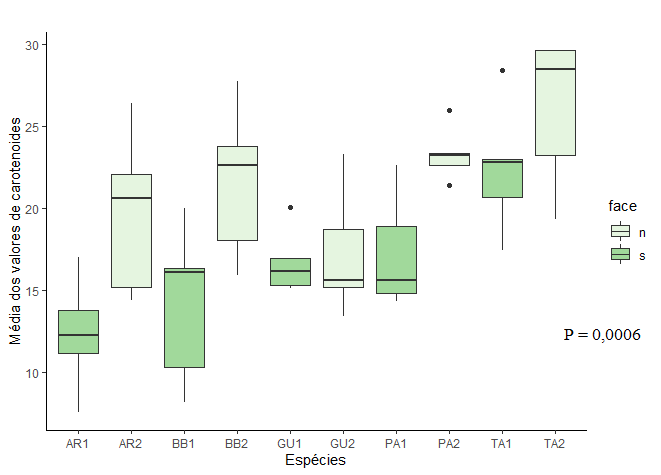

```{r setup, include=FALSE}
knitr::opts_chunk$set(echo = TRUE)
```


# Introdução
  Algumas características funcionais em planta e as relações que estas estabelecem com fatores ambientais tem sido utilizado em diversos estudos ambientais, em especial os que buscam promover comparação em nível global. As Características foliares são freqüentemente citadas como principais indicadores no relacionamento do uso de recursos pelas plantas.
  
  A lâmina foliar possui todo o aparato fotossintético da planta, por essa razão é o órgão mais plástico do organismo vegetal, respondendo em nível morfológico e fisiológico as variações no ambiente. Por esse motivo, parâmetros fisiológicos são de fácil quantificação. As características foliares são geralmente medidas no auge da estação de crescimento quando as condições ambientais favorecem a assimilação de carbono e há abundância de folhas expandidas e saudáveis.Existem diversos trabalhos que abordam  características foliares e suas inter-relações em ambientes florestais conservados. Entretanto, estudos com esse objetivo em ambientes de restauração são insuficientes e escassos. 
  
 Tendo em vista a escasses e trabalhos que relacionem características foliares e suas relações com as variações ambientais em ambientes de restauração ecológica, o trbalho que segue tem por objetivo principal a avaliação da variação espacial nas concentrações foliares de carotenóides em espécies utilizadas no processos de restauração ecológica de uma floresta ombrofila, fitofissionomia da Mata atlântica.
 
#Material e métodos 
###Área de estudo 
  O local de trabalho compreende um morrote de aproximadamente 1600 por hectare inserido em uma fazenda (Fazenda Igarapé) da década de 1970 situada na cidade de Silva Jardim-RJ, Brasil. 
  
  A fazenda adquirida em fevereiro de 2018 pela Associação Mico Leão Dourado (AMLD),passa por processo de restauração ecológica, com os trabalhos iniciados em outubro de 2018,com 89 espécies. As mudas foram plantadas em sacos plásticos provenientes de 5 viveiros regionais para a ligação de fragmentos e a preservação da biodiversidade.
  
###Quantificação dos pigmentos fotossintéticos 
  Para a quantificação dos pigmentos fotossintéticos, um disco de 5 mm foi retirado da lâmina foliar das espécies selecionadas. Cada disco foliar foi colocado em eppendorf's contendo 1 mL de solvente orgânico (dimetilsufóxido, DMSO). Os tubos foram envolvidos com papel de alumínio com o fim de proteger a solução aos possíveis danos causados pela luz. Após 5 dias, o extrato foi analisado em espectrofotômetro a 480 nm, 649 nm e 665nm, para a quantificação das clorofilas a, b, carotenoides, clorofilas totais (a + b) e razão clorofila a/b. Para a quantificação destes pigmentos será utilizada a equação proposta por Wellburn (1994). Os valores serão expressos em nmol cm-2.
  
#Resultados e discussões 
  A partir das análises estatísticas realizadas para os valores de carotenóides (Figura 1)podemos contastar a influência exercida pelas diferencas espacias no local do estudo, em especial a declividade do terreno,que expõe as plantas da face norte a mais horas de irrâdiancia do que as plantadas na face sul. 


  

